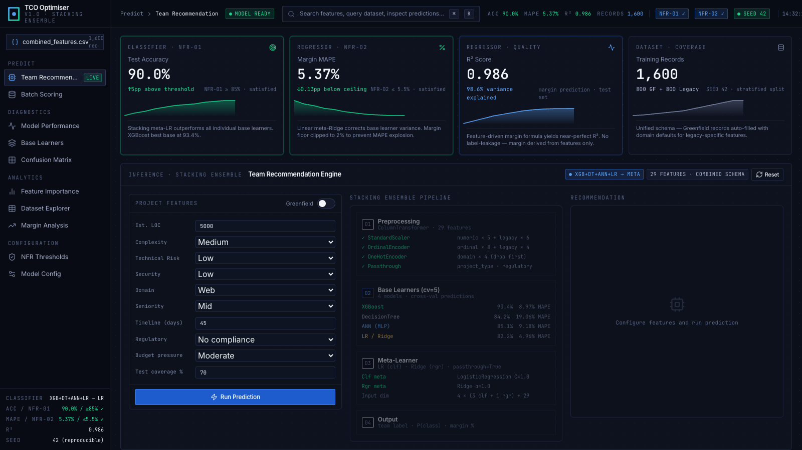
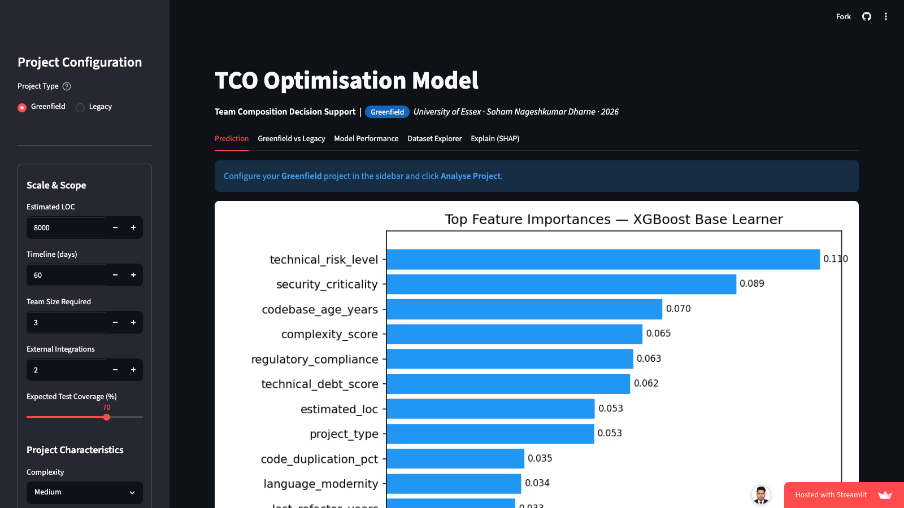

# TCO Optimisation Model

**ML-powered team composition recommender for software delivery projects**

[](https://github.com/Data-eng15/cost-optimization-model/actions/workflows/ci.yml)
[](https://data-eng15.github.io/cost-optimization-model/)
[](https://cost-optimization-model-3mj7ttpqdjdzbdu4fzzceu.streamlit.app/)
[](https://cost-optimization-model.onrender.com/docs)

> University of Essex · Soham Nageshkumar Dharne · 2026

---

## What It Does

Given a software project's characteristics — size, risk, domain, tech stack, legacy debt — the model recommends which team type minimises Total Cost of Ownership:

| Recommendation | When |
|---|---|
| 🧑‍💻 **Human** | High risk, regulated, complex legacy, critical security |
| 🤝 **Hybrid** | Medium complexity — human oversight + AI assistance |
| 🤖 **AI** | Low-risk, small scope, modern stack, budget-constrained |

It also predicts the **expected profit margin %** for that configuration.

| Link | What it is |
|------|-----------|
| **[→ Streamlit App](https://cost-optimization-model-3mj7ttpqdjdzbdu4fzzceu.streamlit.app/)** | Full ML dashboard — real inference, SHAP explainability, dataset explorer |
| **[→ REST API /docs](https://cost-optimization-model.onrender.com/docs)** | FastAPI Swagger UI — test `/predict` directly in the browser |

### React Dashboard (GitHub Pages)
[](https://data-eng15.github.io/cost-optimization-model/)

### Streamlit App — Full ML Inference + SHAP
[](https://cost-optimization-model-3mj7ttpqdjdzbdu4fzzceu.streamlit.app/)

---

## Results

| Metric | NFR Target | Achieved |
|---|---|---|
| Classification accuracy | ≥ 85% | **90.0%** ✓ |
| Profit margin MAPE | ≤ 5.5% | **5.37%** ✓ |
| Regression R² | — | **0.986** |
| NFR-06 (no AI on critical risk) | 100% | **100%** ✓ |
| Test suite | Pass | **38/38** ✓ |

Trained on **1,600 synthetic project records** (800 Greenfield + 800 Legacy) with a 29-feature unified schema.

---

## Architecture

```
Input (29 features: 16 shared + 10 legacy-specific + project_type)
        │
        ▼
ColumnTransformer
  ├── StandardScaler      (5 numeric features)
  ├── OrdinalEncoder      (8 ordinal + 4 legacy ordinal)
  ├── OneHotEncoder       (domain_category → 4 dummies)
  └── PassThrough         (project_type, regulatory_compliance)
        │
        ▼
StackingClassifier                    StackingRegressor
  ├── XGBoost  (93.4% solo)             ├── XGBoost
  ├── Decision Tree  (84.2%)            ├── Decision Tree
  ├── ANN 128→64→32  (85.1%)            ├── ANN 128→64→32
  └── Logistic Regression  (82.2%)      └── Linear Regression
        │  5-fold OOF + passthrough=True        │
        ▼                                       ▼
  Meta: Logistic Regression             Meta: Ridge Regression
        │                                       │
        ▼                                       ▼
  Human / Hybrid / AI                   Profit Margin %
```

> XGBoost alone achieves 93.4% accuracy. The stacking ensemble trades 3.4 points of raw accuracy for better-calibrated probabilities and robustness — intentional.

---

## NFR-06 Safety Gate

Critical-risk or critical-security projects are **never** routed to AI regardless of other features. This constraint is encoded in the training data synthesis rules and verified by dedicated tests.

---

## Quick Start

```bash
git clone https://github.com/Data-eng15/cost-optimization-model.git
cd cost-optimization-model
pip install -r requirements.txt

# Run tests
PYTHONPATH=src python -m pytest tests/ -v

# Launch Streamlit dashboard (full ML inference)
streamlit run app/dashboard.py

# Or serve the static React dashboard
cd app/frontend && python3 -m http.server 8502
```

---

## Project Structure

```
├── src/
│   ├── config.py               Paths, 29-feature schema, hyperparameters
│   ├── data_synthesis.py       Synthetic data generator (Greenfield + Legacy)
│   ├── feature_engineering.py  ColumnTransformer pipeline + train/val/test split
│   ├── model.py                Stacking ensemble — build, train, evaluate, infer
│   └── utils.py                Logging, metrics, serialisation helpers
├── app/
│   ├── dashboard.py            4-tab Streamlit app (full ML inference)
│   └── frontend/index.html     React + Tailwind static dashboard (GitHub Pages)
├── models/
│   ├── xgboost_classifier.pkl  Trained classification pipeline
│   ├── stacking_regressor.pkl  Trained regression pipeline
│   └── model_metadata.json     All metrics, importances, hyperparams
├── data/processed/
│   └── combined_features.csv   1,600-row unified training dataset
├── results/
│   ├── metrics/sprint_one_evaluation.json
│   └── visualizations/         Confusion matrix + feature importance plots
├── tests/                      38 unit tests (all passing)
├── notebooks/                  4 Jupyter notebooks (synthesis → EDA → FE → training)
└── docs/
    ├── REVERSE_ENGINEERING.md  Complete concept breakdown (start here)
    ├── model_architecture.md
    ├── feature_rationale.md
    └── data_generation_methodology.md
```

---

## Key Design Decisions

**Why stacking over a single model?**
The meta-learner learns *when* to trust each base learner. XGBoost dominates on ordinal feature signals; the ANN captures non-linear security/compliance interactions. Averaging blends at equal weight regardless of context.

**Why synthetic data?**
No public SRS dataset exists at this granularity. All synthesis logic is domain-informed, rule-based, and fully reproducible from `SEED=42`. See `docs/data_generation_methodology.md`.

**Why Greenfield *and* Legacy?**
Legacy projects have fundamentally different economics — technical debt, codebase age, team familiarity, and incident rate shift the Human/AI trade-off significantly. The 10 legacy-specific features capture this; Greenfield rows receive sensible defaults so both project types train on one unified model.

**Why recall > precision for Human class?**
A false negative (recommending AI for a project needing human oversight) costs orders of magnitude more than a false positive. A case study — an autonomous AI agent that deleted an entire production database in 9 seconds — quantifies this asymmetry.

---

## Reproducibility

All stochastic components use `SEED=42` from `src/config.py`. Re-running `python src/data_synthesis.py && python src/model.py` from any machine produces identical artefacts.

---

## References

1. Dharne, S.N. — *Socio-Cognitive Dynamics of Pure Automation vs. Hybrid Orchestration*, University of Essex, 2026
2. Ahmad, M.O. — *Comprehension Debt in GenAI-Assisted SE Projects*, EASE 2026
3. Brynjolfsson et al. — *Micro Gains, Macro Disappointment*, Stanford Digital Economy Lab, 2025
4. McKinsey Global AI Survey — *The Economics of Agentic Automation*, 2026
5. IEEE Std 830-1998 — *Recommended Practice for Software Requirements Specifications*
